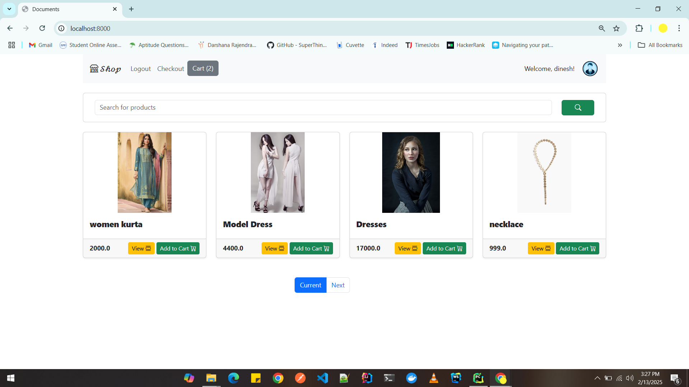
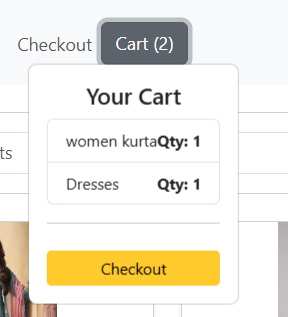
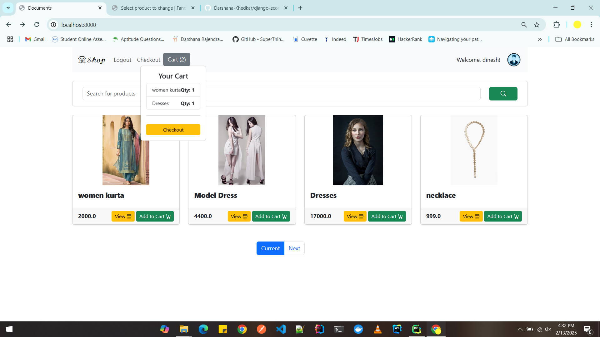
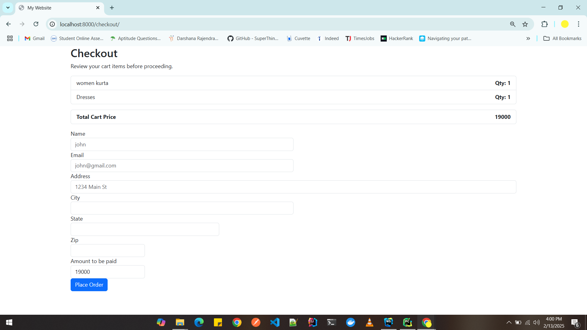
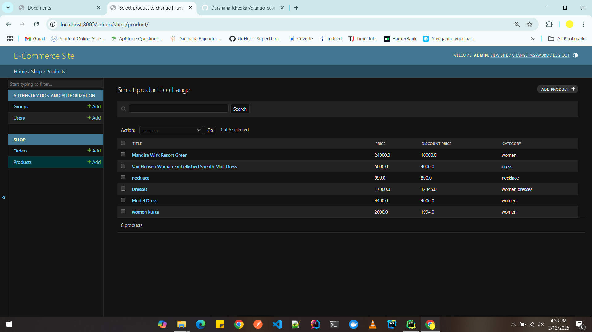
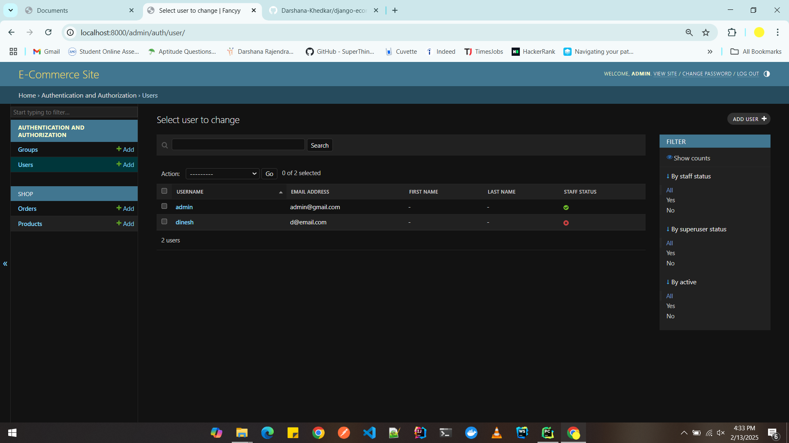

# 🛒 Django E-commerce Website

## 📌 Overview
This is a **basic e-commerce website** built using **Django**. It includes essential features such as **user authentication, product listing, product details, shopping cart, and checkout process**.

---

## 🏠 Home Page
The homepage displays a list of available products with pagination.





---

## 🚀 Features
- ✅ **User Authentication**: Login, Logout, and Registration using Django’s built-in authentication system.  
- ✅ **Home Page (Index Page)**: Displays products with pagination.  
- ✅ **Product Detail Page**: Shows individual product details.  
- ✅ **Shopping Cart**: Users can add products to a cart.  
- ✅ **Checkout Page**: Users enter shipping details and confirm their orders.  
- ✅ **Session-based Cart Management**: Shopping cart items persist until checkout.  
- ✅ **Admin Panel**: Manage products, users, and orders.  

---

## 🛍️ Checkout Page
Users can review their cart and proceed to checkout.



---

## 🛠️ **Project Structure**


```
 Ecommerce_basic/
│── ecom/
│   │── appusers/  # Handles user authentication
│   │   │── migrations/
│   │   │── templates/
│   │   │── __init__.py
│   │   │── admin.py
│   │   │── apps.py
│   │   │── models.py
│   │   │── tests.py
│   │   │── urls.py
│   │   │── views.py
│   │
│   │── shop/  # Manages products and shopping features
│   │   │── migrations/
│   │   │── static/
│   │   │── templates/
│   │   │── __init__.py
│   │   │── admin.py
│   │   │── apps.py
│   │   │── models.py
│   │   │── tests.py
│   │   │── views.py
│   │
│   │── ecom/  # Main Django project settings
│   │   │── __init__.py
│   │   │── asgi.py
│   │   │── settings.py
│   │   │── urls.py
│   │   │── wsgi.py
│
│── manage.py  # Django management script
│── requirements.txt  # List of dependencies
│── README.md  # Project documentation

```

## URL Routing

Django's URL routing system allows us to map different URLs to specific views. The project is structured as follows:

1. **Project-Level URL Configuration (`ecom/urls.py`)**
   - Includes `appusers.urls` for authentication (`/users/`)
   - Includes `shop.urls` for products and cart (`/shop/`)

2. **User Authentication Routes (`appusers/urls.py`)**
   - `/users/register/` → New user registration
   - `/users/login/` → Login page
   - `/users/logout/` → Logout action

3. **Shop and Product Routes (`shop/urls.py`)**
   - `/shop/` → Displays all products (Home Page)
   - `/shop/product/<id>/` → Shows product details
   - `/shop/cart/` → Displays the shopping cart
   - `/shop/checkout/` → Checkout process

4. **Static Files & Templates Configuration**
   - Static files (CSS, JS) are served via Django’s `static/` directory.
   - HTML templates are loaded from `templates/`.

This modular routing structure makes it easy to maintain and scale the project.

```python
from django.contrib import admin
from django.urls import path
from shop import views

urlpatterns = [
    path('admin/', admin.site.urls),
    path('', views.index, name='index'),
    path('<int:id>/', views.detail, name='detail'),
    path('checkout/', views.checkout, name='checkout'),
]
```

## Templates
### `index.html`
- Displays product listings with images, names, and prices.
- Pagination for browsing multiple products.
- JavaScript for handling cart functionality using localStorage.

### `detail.html`
- Shows product details including image, title, price, discount, and description.

### `checkout.html`
- Displays the cart summary.
- Collects user shipping details and submits them for processing.

## JavaScript (Cart Management)
- Uses `localStorage` to store cart items.
- Updates total price dynamically.
- Handles add-to-cart functionality.

## Setup and Installation
### 1: Install Dependencies

``pip install -r requirements.txt``

### 2: Apply Migrations

``python manage.py makemigrations python manage.py migrate``

### 3: Create a Superuser (Admin Panel Access)

``python manage.py createsuperuser``

## Follow the prompts to set up an admin user.

### 6: Run the Development Server

``python manage.py runserver``

Now, open http://127.0.0.1:8000/ in your browser.

## 🎯 Usage
- Register/Login as a user.
- Browse products on the homepage.
- View product details and add them to the cart.
- Proceed to checkout, enter details, and place an order.
- Admin Panel: Visit http://127.0.0.1:8000/admin/ to manage the store.

## ⚙️ Technology Stack
- Backend: Django 4.x, Python 3.10
- Frontend: HTML, CSS, Bootstrap
- Database: SQLite (default), can be switched to PostgreSQL/MySQL
- Authentication: Django’s built-in authentication system
## 🚀 Future Enhancements
- 📌 Payment Integration (Stripe/PayPal)
- 📌 Order History and Tracking
- 📌 User Reviews and Ratings
- 📌 Wishlist Feature

## Project Screenshots
- Home page


- Checkout Page



- Admin Panel



- Users 
- 

